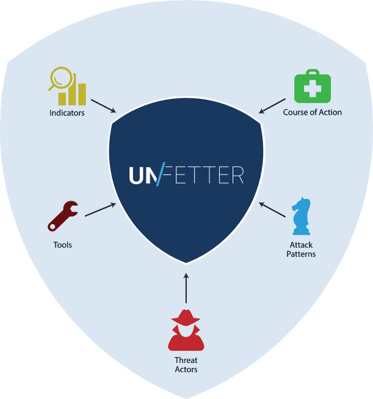

When the threat hits, cyber security professionals working at the tactical, operational, and strategic levels need to work together quickly and effectively to enable a common cyber security strategy and protect against the adversary. The ability to do this in a repeatable and scalable way depends on an organization's agility to discover gaps in their security posture, understand adversary tradecraft, and communicate defensive courses of action.

Unfetter enhances your current assessment methodology and helps you figure out what to do next by focusing on the key relationships in your data.  Inspired by MITRE's <a href="https://car.mitre.org/wiki/Main_Page">CAR</a> and <a href="https://attack.mitre.org" target="_blank">ATT&amp;CK&#8482;</a> framework, Unfetter shifts the focus beyond indicators to a more behavioral based methodology that allows you to advance your cyber security posture in a measurable and meaningful way.

<h2><i class="material-icons">group</i> Leveraging the Community

    Unfetter makes it easier to get started and take advantage of community threat models like MITRE's
    <a href="https://attack.mitre.org" target="_blank">ATT&amp;CK&#8482;</a>. Cyber security professionals can use Unfetter to establish
    a baseline security posture, explore relationships to identify gaps, and experiment with defensive courses of action before the threat hits. 
    You can read more about MITRE's efforts at the
    <a href="https://mitre.github.io/unfetter" target="_blank">MITRE GitHub Page</a>.

<h2><i class="material-icons">security</i> Analytics in Context
						
 						
Our initial prototype, <a href="https://github.com/unfetter-analytic/unfetter" target="_blank">Unfetter Analytic</a>, 
						 is a reference implementation of a platform designed to help analytic developers experiment and gain familiarity with the 
						 <a href="https://attack.mitre.org" target="_blank">ATT&amp;CK&#8482;</a> framework as a means of measuring the effectiveness of analytics.

<h2><i class="material-icons">settings</i> Discover Gaps</h2>

Our second prototype, <a href="https://www.github.com/unfetter-discover/unfetter" target="_blank">Unfetter Discover</a> 
    is aimed at helping the user explore additional gaps across their security posture and experiment with next steps.  The 
    initial focus is on mapping mitigations and security controls to <a href="https://attack.mitre.org" target="_blank">ATT&amp;CK&#8482;</a> 
    and demonstrating how to explore, learn, and communicate between tactical, operational, and strategic levels of operation.

