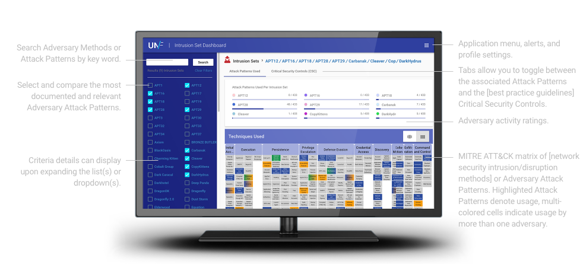

 <!--INTRO/HEADER-->
    

        

            <h1 class="hero">The Unfetter Project</h1>
            
Discover and analyze gaps in your security posture.

        

        

            
        

    

<!-- /.container -->

 <!--FIRST TEXT BLOCK-->
    

        

            <h1>Discover Gaps. Analytics in Practice. Leverage the Community.</h1>
        

    

    

        

            

                When the threat hits, cybersecurity professionals working at the tactical,
                operational, and strategic levels need to work together quickly and effectively 
                enable a common cybersecurity strategy that protects against the adversary. To do
                this in a repeatable, scalable way depends on an organization’s ability to discover
                and mitigate gaps in their posture, understand adversary tradecraft, and implement and communicate
                defensive courese of action.
            

        

    

    

        

            <h4>We are an experiment (right now)</h4>
            

                Unfetter is a community-driven suite of open source tools
                leveraging the <a href="https://attack.mitre.org/wiki/Main_Page">MITRE ATT&amp;CK&trade;</a> framework,
                shifting the
                focus from indicators to a behavior-based
                methodology. This allows you to more effectively assess
                your risk, advance your security posture, and implement
                mitigations in a systemic, measurable, and meaningful way.
            

        

        

            <h4>Cyber professionals can use Unfetter to:</h4>
            <ul>
                <li>Establish a better baseline security posture</li>
                <li>Explore relationships to rapidly identify gaps</li>
                <li>Evaluate and compare defensive courses of action</li>
            </ul>
        

    

<!--DIVIDER IMAGE-->
    

        

            
        

        

            
        

    

    
<!--Capability Assessment-->
        

            

                <h1><b>Unfetter Discover:</b> Analyze seucrity gaps and explore adversary tradecraft.</h1>
            

        

        

            

                

                    Unfetter Discover provides a workflow that helps Threat Reporters, Analytic Developers and Network Defenders create and share complex Cyber Threat Intelligence (CTI) data among their peers and across teams.

 <a class="btn btn-outline-secondary btn-white" href="about.html">LEARN MORE</a>

            

        

        

            

                

                    

                        <h2 class="text-center text-lg-left">The Users</h2>
                        

                            Unfetter Disocover builds tools for cyber experts to help them create, share and use complex Cyber Threat Intelligence information.  Threat Reporters are making sense of the vast amount of research and reporting, Analytic Developers are crafting new detections, and Network Defenders are tackling gaps in their networks and need to know what to focus on next.
                        

                    

                    

                        
                    

                

            

        

    

   
<!--DIVIDER IMAGE-->
        

            

                
            

            

                
            

        

    

    

        

            <h1 class="text-aqua"><b>Unfetter Analytic:</b> Measure the
                effectiveness of your analytics.</h1>
        

    

    

        

            

                Unfetter Analytic is a prototype that allows developers to gain familiarity with the
                ATT&amp;CK&trade; framework to measure the effectiveness of their analytics. Write analytics and
                map them to the MITRE ATT&amp;CK&trade; techniques you want to detect. When the analytic
                event is created, the Kibana display shows the context around the event.
            

            <a href="analytics-overview.html" class="btn btn-primary btn-aqua">Learn  More</a>
        

    

<!--COLORED FOOTER-->
    

        

            

                

                    <h2>The Future of Unfetter</h2>
                    

                        There are lots of areas that Unfetter is looking to focus.
                    

                    <ul class="text-light">
                        <li>Automatically read and associate threat reports with MITRE ATT&amp;CK&trade; techniques
                        </li>
                        <li>Translate and convert analytics to work in
                            Elasticsearch, Splunk, etc.
                        </li>
                        <li>Ingest and evaluate threat intelligence data using
                            crowdsourced partner data
                        </li>
                        <li>Automatically ingest complex threat data from trusted
                            sources and update mitigations
                        </li>
                        <li>Increase detail and granularity of threat reporting
                            dashboards
                        </li>
                        <li>Increase Red and Blue Team effectiveness with the Purple Team Operations Planner</li>
                    </ul>
                

            

        

        

            

                

                    
                    <h2>Meeting the needs of all users</h2>
                    

                        Each workflow is focused on the unique needs
                        and requirements of security professionals.
                    

                    <ul class="text-light">
                        <li>Threat Reporters research, document, and analyze threat reports</li>
                        <li>Net Defenders track and assess gaps in their networks</li>
                        <li>Threat Analysts build, evaluate, and share new behavior-based analytics</li>
                    </ul>
                

            

        

    

<!--DARK CALLOUT-->
    

        

            

                <h1 class="py-sm-5">Join the Experiment. 
                    Developers and
                    Security Professionals welcome.</h1>
            

            

                

                    Unfetter is open source and looking for partners. If you have
                    an idea for new functionality or a new workflow, let us know
                    and submit an issue in <a href="https://github.com/unfetter-discover/unfetter">GitHub</a>. If you are a developer and
                    have ideas on how to contribute, we welcome a pull request. We’re excited for everyone to join the experiment.
                

                <a name="" id="" class="btn btn-primary" href="https://github.com/unfetter-discover/unfetter"
                   role="button">Download Unfetter</a>
            

        

    

